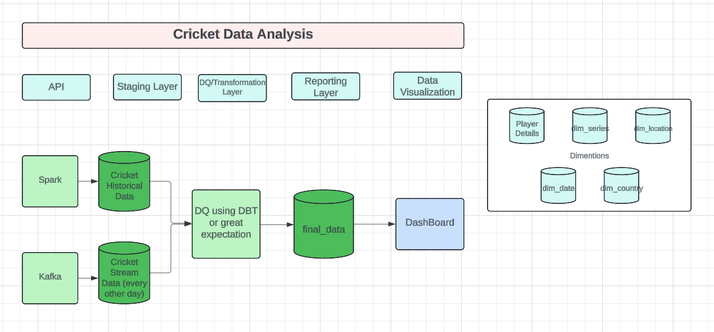

## Cricket Data Analysis 

##### Author: Leena Patil
##### Version: V1.0

#### The goal of this data engineering project is to analyse following

1. Team Ranking: List of international teams ranking based on match type.
2. Top Wicket: Top wicket takers.
3. Season Max Matches: Max matches per country per year
4. Bowling Economy Rate: Runs conceded per over bowled, measuring a bowler’s efficiency in restricting runs. 
5. Batting Average: Total runs scored divided by times dismissed, indicating a batsman’s consistency.
6. Strike Rate: Runs scored per 100 balls faced, reflecting an aggressive or cautious approach.

#### Project Summary:

1. Data Extraction :
   1. Get historical data using python
   2. Get stream data which gets updated every other using Kafka
2. Data Modelling, Loading : Initially I am thinking of loading data is locally (V1.0) and then might to postgres or snowflake (V1.1).
3. Implement a Realtime pipeline: Kafka streaming service which gets data every other day
4. DQ: Data quality testing I might use python great expectation or DBT DQ checks
5. Dashboard: Create simple dashboard using PowerBI or Tableau

#### Tech Stack for V1.0

1. Spark 
2. Kafka 
3. Postgres 
4. Airflow 
5. PowerBI or Tableau

#### Tech Stack for V1.1

1. Spark 
2. AWS 
3. DBT 
4. Snowflake 
5. Kafka 
6. Airflow 
7. PowerBI or Tableau

###  Cricket Data Analysis Diagram

